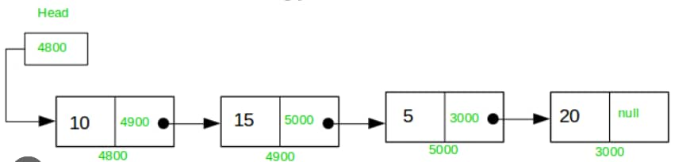

# Data Structure

A specialized format for organizing, processing, retrieving and storing data

- Array
- Linked-List
- Stack
- Queue
- Tree
- Graph
- Hash Table
- Heap
- Trie
- Graphical Models

## Array 

## Linked-List
A linked list is a linear collection of data elements whose order is not given by their physical placement in memory, they has two type that `Singly Linked-List` and `Doubly Linked-List`

### Singly Linked-List 

